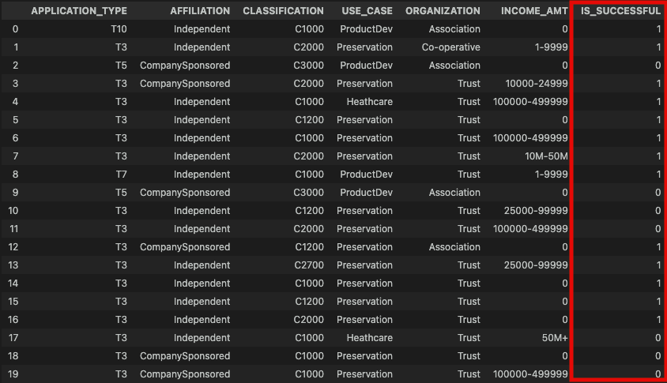

# deep-learning-challenge

## Overview
#### This analysis is being conducted on behalf of the non-profit organization Alphabet Soup. This is to be used as a tool to find applicants with the best chance of being successful in their business ventures. By training this machine learning model with the metadata provided, we are better able to provide insight into which business types have been successful in order to predict what new business models might perform like to the same standards. 

## Results
### *** This is the target variable for this model:

### *** These are the feature variables for this model:

#### *** The columns removed from the original dataset include 'EIN','NAME',"SPECIAL_CONSIDERATIONS","STATUS", and "ASK_AMT" as these columns did not provide any value to the machine learning process.

#### *** The machine learning model consists of 3 layers. In the first layer "relu" was used. In the second and third layer "sigmoid" was used. The model contained a total of 11,801 neurons. After implementing and testing multiple layers with different activation functions and different numbers of neurons it was found that this was the most effective layout. 

#### *** The target performance of the model was 75%; however, after many times of changing and running the model the highest achieved was 74%. 

#### *** Steps to increase the models performance included; dropping feature columns, increasing the number of neurons, changing activation functions, and adding multiple layers. 

## Summary
#### 

